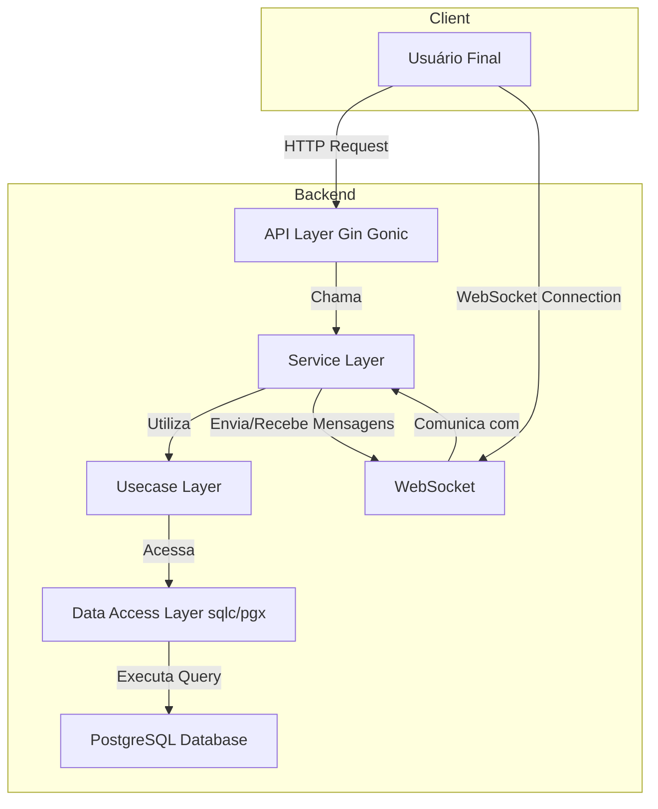

# GoBid Auction API

GoBid is a robust and scalable backend API for an online auction platform, built with Go. It provides functionalities for user management, product listings, and real-time bidding via WebSockets.

## Arquitetura

O projeto segue uma arquitetura em camadas para separação de interesses, garantindo manutenibilidade e escalabilidade. O fluxo de uma requisição HTTP típica passa pela camada de API, que invoca a lógica de negócios na camada de Serviço, que por sua vez utiliza os Casos de Uso para validação e orquestração, e finalmente acessa o banco de dados através da Camada de Acesso a Dados gerada pelo `sqlc`.



## Principais Funcionalidades

- **Autenticação de Usuários:** Sistema completo de `signup`, `login` e `logout` com gerenciamento de sessão.
- **Proteção CSRF:** Geração de token para proteger contra ataques de Cross-Site Request Forgery.
- **Gerenciamento de Produtos:** Criação de produtos que podem ser leiloados.
- **Lances em Tempo Real:** Utiliza WebSockets para permitir que múltiplos usuários deem lances em um produto e recebam atualizações instantâneas.
- **CLI para Migrations:** Ferramenta de linha de comando (`terndotenv`) para gerenciar o versionamento do banco de dados (criar, aplicar, reverter migrações).

## Tecnologias Utilizadas

- **Linguagem:** Go
- **Framework Web:** [Gin Gonic](https://gin-gonic.com/)
- **WebSockets:** [Gorilla WebSocket](https://github.com/gorilla/websocket)
- **Banco de Dados:** PostgreSQL
- **Driver & ORM/Generator:** [pgx](https://github.com/jackc/pgx) e [sqlc](https://sqlc.dev/)
- **Containerização:** Docker & Docker Compose
- **Migrations:** [tern](https://github.com/jackc/tern)

## Como Começar

Siga os passos abaixo para configurar e executar o ambiente de desenvolvimento local.

### Pré-requisitos

- [Go](https://go.dev/doc/install) (versão 1.20+)
- [Docker](https://docs.docker.com/get-docker/) e [Docker Compose](https://docs.docker.com/compose/install/)
- [sqlc](https://docs.sqlc.dev/en/latest/overview/install.html)

### Instalação e Execução

1.  **Clone o repositório:**
    ```bash
    git clone https://github.com/JoaoRafa19/gobid.git
    cd gobid
    ```

2.  **Configure as variáveis de ambiente:**
    Copie o arquivo de exemplo `.env.example` para um novo arquivo chamado `.env`.
    ```bash
    cp .env.example .env
    ```
    *Revise o arquivo `.env` e ajuste as variáveis se necessário.*

3.  **Gere o código SQLC:**
    O `sqlc` irá ler as queries em `internal/store/pgstore/queries` e gerar o código Go correspondente.
    ```bash
    sqlc generate
    ```

4.  **Inicie o banco de dados:**
    Use o Docker Compose para iniciar o container do PostgreSQL em background.
    ```bash
    docker-compose up -d postgres
    ```

5.  **Execute as migrações do banco de dados:**
    Use a CLI customizada para aplicar as migrações.
    ```bash
    go run ./cmd/terndotenv/main.go migrate
    ```

6.  **Inicie a API:**
    ```bash
    go run ./cmd/api/main.go
    ```

A API estará rodando em `http://localhost:8080`.

## Caso de Uso: Leilão de um Item

Vamos ilustrar um fluxo de uso comum na plataforma.

**Ator:** Ana, uma usuária interessada em colecionáveis.

1.  **Cadastro e Login:** Ana acessa o site (frontend, não incluso neste projeto) e cria uma nova conta (`POST /api/v1/users/signup`). Em seguida, ela faz login (`POST /api/v1/users/login`) e seu cliente (navegador) armazena o cookie de sessão.
2.  **Listando um Item:** Outro usuário, Beto, decide leiloar um item. Ele se autentica e faz uma requisição `POST /api/v1/products` com os detalhes do produto.
3.  **Entrando no Leilão:** Ana navega pelo site e encontra o item de Beto. Ela se interessa e clica para participar do leilão. Seu cliente estabelece uma conexão WebSocket com o servidor (`GET /api/v1/products/ws/subscribe/{product_id}`).
4.  **Dando Lances:** Ana recebe o preço atual do item via WebSocket. Ela decide dar um lance, enviando uma mensagem através da conexão. O servidor processa o lance, atualiza o preço e transmite a atualização para todos os outros usuários conectados ao leilão daquele item.
5.  **Fim do Leilão:** O leilão termina. O servidor envia uma mensagem final via WebSocket para todos os participantes, declarando Ana como a vencedora.

## Evolução do Projeto

Este projeto tem uma base sólida, mas pode ser expandido com diversas funcionalidades para se tornar uma plataforma de leilão completa:

- **Histórico de Lances:** Armazenar e expor um histórico completo de todos os lances para cada produto.
- **Categorias e Busca:** Implementar um sistema de categorização de produtos e uma funcionalidade de busca avançada.
- **Notificações:** Enviar notificações (e-mail ou push) aos usuários quando eles forem superados em um lance ou quando vencerem um leilão.
- **Agendamento de Leilões:** Permitir que os usuários agendem uma data e hora de início e fim para seus leilões.
- **Testes:** Expandir a cobertura de testes, incluindo testes de integração para os fluxos de API e testes de unidade para a camada de serviço.
- **Deployment:** Criar scripts e configurações para deploy automatizado em ambientes de produção (ex: Kubernetes, Cloud Run).
